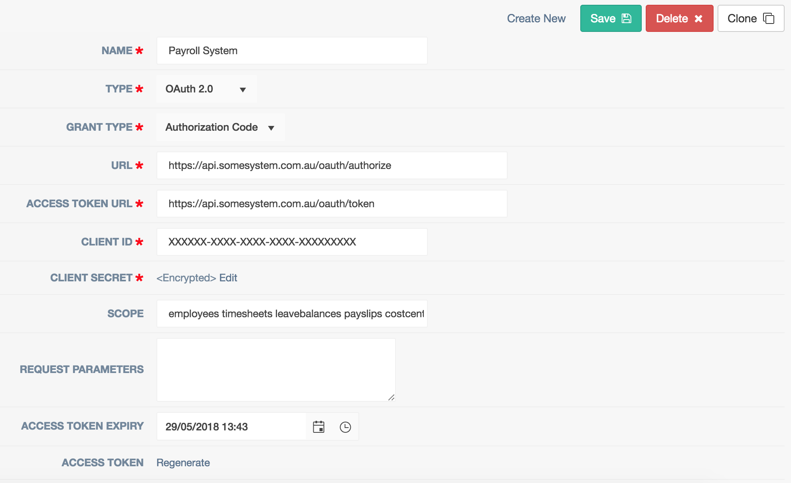
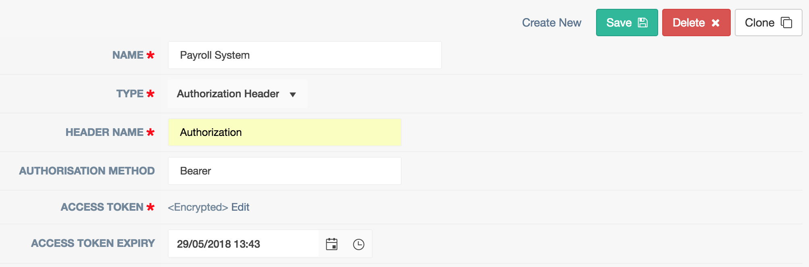

Authentication
==============

Most connections will require some sort of authentication to occur to enable access to remote resources. Authentication
configuration is performed through Integration > Authentication screen and then linked to configuration file using
record Id. A number of authentication types are supported. Additional types will be added as required.

OAuth 2
^^^^^^^

This is probably the most common authentication type used with RESTful APIs. Multiple Grant Types are supported
including ``Authorization Code``. OAuth dance can be performed through this page by clicking on ``Generate`` link.
SHaRpi will then keep track of access and refresh tokens (if available) and request new tokens as required.

Authorization Header
^^^^^^^^^^^^^^^^^^^^

A simple header authentication method where access token is passed as a header with each request. This type allows
users to specify header name, method (e.g. Bearer) and access code.

