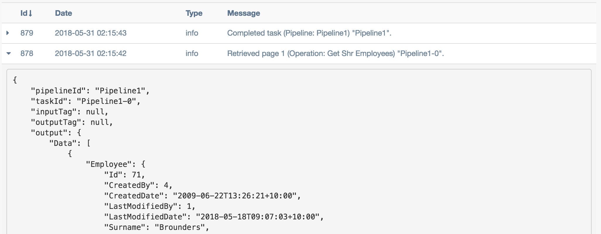

Tutorial
=========

This tutorial will outline how to extract data from Subscribe-HR and then send it to a RESTful API end point.

Template Structure
------------------

The following array represents bare-bones configuration file that will be used to run our export. If you tried to
run it now it would not pass validation because our main pipeline is empty. Following sections will detail creation of
components in the file to create a fully working configuration.

.. code-block:: javascript

    var configuration = {
        RuntimeSettings: {
            Version: "1.0",
            Name: "SampleExport",
            LogPayload: true,
            EntryPipelineId: "Pipeline1"
        },
        Connections: {},
        Operations: {},
        Mappings: {},
        Functions: {},
        Pipelines: {
            Pipeline1: []
        }
    };

Setting Up Connections
----------------------

The first thing that we need to do is to add some connections. Operations cannot be performed without connections.
One way to describe connections is they are client libraries designed to handle specific protocols. They establish line
of communication to local or remote resources and allow operations to perform actions.

Because we are trying to export data from Subscribe-HR the first connection that needs to be created is Datum. Datum
is internal name of data layer that is used in Subscribe-HR platform to handle all underlying data actions. Think of
it as our proprietary ORM library.

Datum connection definition is simple because all information about it is already available through the system.
It simply looks like this.

.. code-block:: javascript

    ShrConnection: {
        Type: "Datum",
        Name: "Datum Connection"
    }

Next we need to create a connection to RESTful API. It requires couple more parameters than Datum connection. We provide
base URL for all requests and authentication record Id so that our connection knows how to handle authentication.

.. code-block:: javascript

    ApiConnection: {
        Type: "Restful",
        Name: "RESTful API Connection",
        Url: "https://api.somesystem.com.au",
        Authentication: 1
    }

Adding Operations
-----------------

Having connections is great but not very useful without being able to perform operations. So what we will do next is
to create some operations that we can use in execution pipelines.

Because we are trying to export some employee data, first operation will query it through Datum connection. Key
parameters are ``Action`` and ``Query``. We are executing SSQL query. Pagination parameter is also defined with max
items set to 10 which means that if there are more than 10 records this operation will run in batches. It will not
happen in this case because we are querying 2 employees only.

.. code-block:: javascript

    GetShrEmployees: {
        Name: "Get Shr Employees",
        Connection: "ShrConnection",
        Action: "Query",
        Query: "SELECT e FROM Employee e WHERE e.Id IN (71, 72)",
        ErrorHandlingStyle: "halt",
        Pagination: {
            MaxItemsPerPage: 10
        }
    }

Now that first operation has been defined we can update our configuration template. It now looks like this. Also note
that ``GetShrEmployees`` operation was added to Pipeline1 as first action.

.. code-block:: javascript

    var configuration = {
        RuntimeSettings: {
            Version: "1.0",
            Name: "SampleExport",
            LogPayload: true,
            EntryPipelineId: "Pipeline1"
        },
        Connections: {
            ShrConnection: {
                Type: "Datum",
                Name: "Datum Connection"
            },
            ApiConnection: {
                Type: "Restful",
                Name: "RESTful API Connection",
                Url: "https://api.somesystem.com.au",
                Authentication: 1
            }
        },
        Operations: {
            GetShrEmployees: {
                Name: "Get Shr Employees",
                Connection: "ShrConnection",
                Action: "Query",
                Query: "SELECT e FROM Employee e WHERE e.Id IN (71, 72)",
                ErrorHandlingStyle: "halt",
                Pagination: {
                    MaxItemsPerPage: 10
                }
            }
        },
        Mappings: {},
        Pipelines: {
            Pipeline1: [
                {
                    Type: "Operation",
                    Id: "GetShrEmployees"
                }
            ]
        }
    };

Now let's run the above configuration to see what it does. To do that you will need to first create ``Process`` record
in the system by going to ``Integration > Processes`` and clicking ``Create`` button. Enter process name and paste
configuration into code editor. Press ``Save`` button. No errors should be generated at this stage as our configuration
meets minimal requirements. At this point ``Run Process`` button will appear. Once the button is pressed you will see a
loading icon. At this stage a message has been sent to the worker in the background to let it know that the process
needs to run immediately. It may take few minutes for it to complete depending on the volume of data being processed.
To see what's going on with the process, go to Events tab. It will show all the actions that have been executed.

.. note::

    While testing your configuration ensure that volume of data that is being sent or received is limit to few records
    only. It will make it easier to debug and save a lot of waiting time.

The following image shows entries in my Events tab after executing above configuration. Returned data can be seen in
detailed view ``output`` field.

Adding Iterator
---------------

What are iterators? They help us to run through multiple records. Above example returns two employee records. If we
were working with operation that supports importing multiple employees then at this stage we can just perform data
transformation and call the operation. It however is not the case with a lot of APIs. From our experience the
standard data flow is Get Data => Loop => Transform => Check If New / Existing => Create / Update. So let's create
an iterator for our two records.

 .. code-block:: javascript

    {
        Type: "Iterator",
        Selector: "$.Data",
        OutputTag: "ShrEmployee"
    }

Above example will iterate over ``$.Data[*]``. You will also notice that the record gets tagged at this point.
This is to ensure that if we need to access original data later on in the transformation process that it can easily be
done without performing additional actions.

Adding Another Operation
------------------------

OK so now we have two employee records that we loop over. As mentioned above at this point we probably want to check
if this employee already exists in the destination system before trying to create it. There is a number of ways to do
this. One, we can create a flag that tracks whether employee has already been exported or not. Two, we can try to
always create it and just let it fail. If it fails we then trigger an update pipeline. Three, and this is the method
I personally prefer as it is pretty fail safe, we check whether record already exists in destination system and then
trigger appropriate pipeline. So let's add an operation that checks if record exists or not.

.. code-block:: javascript

    LookupApiEmployee: {
        Name: "API Lookup Single Employee",
        Connection: "ApiConnection",
        Method: "GET",
        Path: "/api/v1/employees/:EmployeeId"
    }

It can be seen in the definition above that this operation will require a URL parameter ``:EmployeeId`` to be passed in.
This can be done using mappings or a function. I prefer mappings as relying on functions can make it harder to maintain
configuration files.

Adding Mappings
---------------

Above operation requires ``EmployeeId`` parameter to be passed in for it to work correctly. We already know from
:ref:`architecture-restful-input` that URL parameters can be passed using ``Parameters.Url`` attribute so we define
some mappings to create this structure.

.. code-block:: javascript

    LookupApiEmployeeMappings: [
        {
            FromField: "$.Employee.EmployeeCode",
            ToField: "$.Parameters.Url.EmployeeId"
        }
    ]

Now let's update our configuration file and add the latest changes.

.. code-block:: javascript

    var configuration = {
        RuntimeSettings: {
            Version: "1.0",
            Name: "SampleExport",
            LogPayload: true,
            EntryPipelineId: "Pipeline1"
        },
        Connections: {
            ShrConnection: {
                Type: "Datum",
                Name: "Datum Connection"
            },
            ApiConnection: {
                Type: "Restful",
                Name: "RESTful API Connection",
                Url: "https://api.somesystem.com.au",
                Authentication: 1
            }
        },
        Operations: {
            GetShrEmployees: {
                Name: "Get Shr Employees",
                Connection: "ShrConnection",
                Action: "Query",
                Query: "SELECT e FROM Employee e WHERE e.Id IN (71, 72)",
                ErrorHandlingStyle: "halt",
                Pagination: {
                    MaxItemsPerPage: 10
                }
            },
            LookupApiEmployee: {
                Name: "API Lookup Single Employee",
                Connection: "ApiConnection",
                Method: "GET",
                Path: "/api/v1/employees/:EmployeeId"
            }
        },
        Mappings: {
            LookupApiEmployeeMappings: [
                {
                    FromField: "$.Employee.EmployeeCode",
                    ToField: "$.Parameters.Url.EmployeeId"
                }
            ]
        },
        Pipelines: {
            Pipeline1: [
                {
                    Type: "Operation",
                    Id: "GetShrEmployees"
                },
                {
                    Type: "Iterator",
                    Selector: "$.Data",
                    OutputTag: "ShrEmployee"
                },
                {
                    Type: "Map",
                    Id: "LookupApiEmployeeMappings"
                },
                {
                    Type: "Operation",
                    Id: "LookupApiEmployee"
                }
            ]
        }
    };

Quick summary of the changes in the pipeline:

    * Call ``GetShrEmployees`` operation which will return two employee records
    * Iterate over results
    * Map record to produce URL parameter
    * Call ``LookupApiEmployee`` to see if record already exists in the destination system

So far so good. Now how do we actually test result of the last operation. This is where logical functions can be
very useful.

Adding Function
---------------

Because last operation is of type RESTful API the response will contain headers, status codes and response body. Refer
to :ref:`architecture-restful-output` for more details. If the API end point is implemented correctly then we should
receive status code 404 if record does not exist. Let's define action of type function with inline function to test for
it.

.. code-block:: javascript

    {
        Type: "Function",
        FunctionType: "Logical",
        Code: function(input) {
            if (input.StatusCode == "404") {
                return "Pipeline2";
            }
            return "Pipeline3";
        }
    }

Deciphering the above. If response code is 404 then trigger ``Pipeline2`` (creation of new record) otherwise go
to ``Pipeline3`` (update existing record).

Adding New Pipeline
-------------------

Now we can add new pipeline to handle record creation. It only requires two actions, Map and Operation. Let's create
another operation and mappings to use in the new pipeline.

.. note::

    Each subsequent action will inherit output of previous action. Tags can be used to work around this issue.

Adding create employee operation.

.. code-block:: javascript

    {
        CreateApiEmployee: {
            Name: "API Lookup Single Employee",
            Connection: "ApiConnection",
            Method: "POST",
            Path: "/api/v1/employees"
        }
    }

Adding mappings.

.. code-block:: javascript

    MapShrEmployeeToApi: [
        {
            FromField: "$.Employee.Id",
            ToField: "$.Data[0].id"
        },
        {
            FromField: "$.Employee.Surname",
            ToField: "$.Data[0].surname"
        },
        {
            FromField: "$.Employee.FirstName",
            ToField: "$.Data[0].firstNames"
        },
        {
            FromField: "$.Employee.StartDate",
            ToField: "$.Data[0].startDate",
            DateFormatFrom: "Y-m-d",
            DateFormatTo: "d-M-Y"
        },
        {
            FromField: "$.Employee.Gender.Value",
            ToField: "$.Data[0].gender",
            Translations: {
                male: "Male",
                female: "Female"
            }
        }
    ]

Putting It All Together
-----------------------

The following configuration can now be used as a template for all integration processes. It should be expanded to add
``Pipeline3`` which should looks very similar to ``Pipeline2`` with small difference in mappings and operator call.

.. code-block:: javascript

    var configuration = {
        RuntimeSettings: {
            Version: "1.0",
            Name: "SampleExport",
            LogPayload: true,
            EntryPipelineId: "Pipeline1"
        },
        Connections: {
            ShrConnection: {
                Type: "Datum",
                Name: "Datum Connection"
            },
            ApiConnection: {
                Type: "Restful",
                Name: "RESTful API Connection",
                Url: "https://api.somesystem.com.au",
                Authentication: 1
            }
        },
        Operations: {
            GetShrEmployees: {
                Name: "Get Shr Employees",
                Connection: "ShrConnection",
                Action: "Query",
                Query: "SELECT e FROM Employee e WHERE e.Id IN (71, 72)",
                ErrorHandlingStyle: "halt",
                Pagination: {
                    MaxItemsPerPage: 10
                }
            },
            LookupApiEmployee: {
                Name: "API Lookup Single Employee",
                Connection: "ApiConnection",
                Method: "GET",
                Path: "/api/v1/employees/:EmployeeId"
            },
            CreateApiEmployee: {
                Name: "API Lookup Single Employee",
                Connection: "ApiConnection",
                Method: "POST",
                Path: "/api/v1/employees"
            }
        },
        Mappings: {
            LookupApiEmployeeMappings: [
                {
                    FromField: "$.Employee.EmployeeCode",
                    ToField: "$.Parameters.Url.EmployeeId"
                }
            ],
            MapShrEmployeeToApi: [
                {
                    FromField: "$.Employee.Id",
                    ToField: "$.Data[0].id"
                },
                {
                    FromField: "$.Employee.Surname",
                    ToField: "$.Data[0].surname"
                },
                {
                    FromField: "$.Employee.FirstName",
                    ToField: "$.Data[0].firstNames"
                },
                {
                    FromField: "$.Employee.StartDate",
                    ToField: "$.Data[0].startDate",
                    DateFormatFrom: "Y-m-d",
                    DateFormatTo: "d-M-Y"
                },
                {
                    FromField: "$.Employee.Gender.Value",
                    ToField: "$.Data[0].gender",
                    Translations: {
                        male: "Male",
                        female: "Female"
                    }
                }
            ]
        },
        Pipelines: {
            Pipeline1: [
                {
                    Type: "Operation",
                    Id: "GetShrEmployees"
                },
                {
                    Type: "Iterator",
                    Selector: "$.Data",
                    OutputTag: "ShrEmployee"
                },
                {
                    Type: "Map",
                    Id: "LookupApiEmployeeMappings"
                },
                {
                    Type: "Operation",
                    Id: "LookupApiEmployee"
                },
                {
                    Type: "Function",
                    FunctionType: "Logical",
                    Code: function(input) {
                        if (input.StatusCode == "404") {
                            return "Pipeline2";
                        }
                        return "Pipeline3";
                    }
                }
            ],
            Pipeline2: [
                {
                    Type: "Map",
                    InputTag: "ShrEmployee",
                    Id: "MapShrEmployeeToApi"
                },
                {
                    Type: "Operation",
                    Id: "CreateApiEmployee"
                }
            ]
        }
    };
